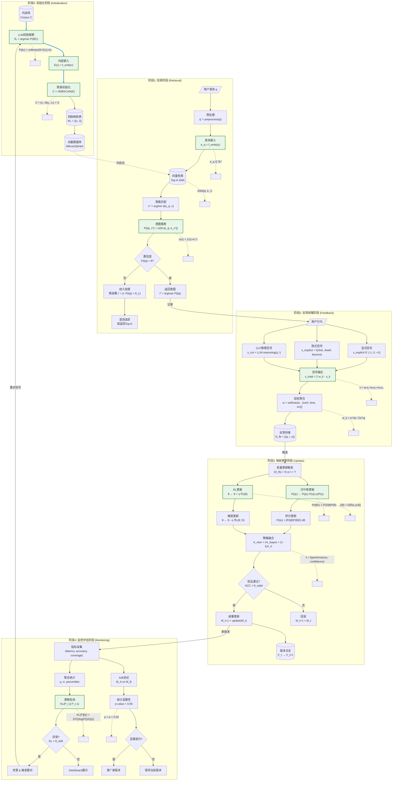

# 内容-意图映射系统端到端流程图

> **创建时间**: 2026-04-03  
> **作者**: agent-flow  
> **团队**: content-intent-math

---

## 一、完整流程图 (Mermaid)



---

## 二、节点公式对照表

### 2.1 初始化阶段

| 节点 | 公式 | 参数说明 |
|------|------|----------|
| **LLM初始推断** | `P(i\|c) = softmax(W·E(c) + b)` | E(c): 内容嵌入, W: 分类权重矩阵, b: 偏置 |
| **聚类初始化** | `C = {cⱼ : d(eⱼ, cₖ) < τ}` | d: 距离函数, τ: 聚类阈值 |
| **初始映射** | `M₀ = {(c, i, P(i\|c))}` | c: 内容, i: 意图, P: 置信度 |

### 2.2 检索阶段

| 节点 | 公式 | 参数说明 |
|------|------|----------|
| **查询嵌入** | `e_q = f_emb(q') ∈ ℝᵈ` | d: 嵌入维度 (通常 768/1536) |
| **向量检索** | `ANN(q, k, τ) = {c₁...cₖ : d(e_q, c) < τ}` | k: Top-K, τ: 距离阈值 |
| **意图推断** | `P(i\|q, c*) = σ(W·[e_q; e_c*] + b)` | σ: sigmoid函数, [;]: 向量拼接 |
| **置信度判断** | `i* = argmax_i P(i\|q)` | θ_H: 高置信阈值, θ_L: 低置信阈值 |

**置信度分支逻辑**:
```
if P(i*|q) > θ_H:     → 直接返回 i*
elif P(i*|q) > θ_L:   → 返回候选集，请求澄清
else:                  → 触发兜底/转人工
```

### 2.3 反馈收集阶段

| 节点 | 公式 | 参数说明 |
|------|------|----------|
| **显式信号** | `s_explicit ∈ {-1, 0, +1}` | -1: 负反馈, 0: 中性, +1: 正反馈 |
| **隐式信号** | `s_implicit = f(click, dwell, bounce)` | 停留时间、点击率、跳出率加权 |
| **CoT信号** | `s_cot = LLM.reasoning(q, i)` | LLM推理链验证 |
| **信号融合** | `s_total = Σₖ w_k · s_k` | w_k: 各信号权重 |
| **权重计算** | `w_k = e^{α_k} / Σ_j e^{α_j}` | α: 信号可信度参数 |

**权重配置示例**:
```yaml
signal_weights:
  explicit: 0.5    # 用户明确反馈，权重最高
  implicit: 0.3    # 行为推断，次高
  cot: 0.2         # LLM推理，辅助验证
```

### 2.4 映射更新阶段

| 节点 | 公式 | 参数说明 |
|------|------|----------|
| **贝叶斯更新** | `P(θ\|D) ∝ P(D\|θ)·P(θ)` | θ: 模型参数, D: 观测数据 |
| **后验推断** | `P(i\|c) = ∫ P(i\|θ)P(θ\|D) dθ` | 参数积分推断 |
| **RL目标** | `J(θ) = E[R(s, a; θ)]` | R: 奖励函数 |
| **梯度更新** | `θ ← θ - η·∇L(θ; D)` | η: 学习率, L: 损失函数 |
| **策略融合** | `π_new = λ·π_bayes + (1-λ)·π_rl` | λ: 融合系数 (动态调整) |

**贝叶斯-RL融合策略**:
```python
def fusion_strategy(performance_bayes, performance_rl, confidence):
    """
    根据各策略表现动态调整融合系数
    """
    λ_base = 0.5
    λ = λ_base * (performance_bayes / (performance_bayes + performance_rl))
    λ = λ * confidence  # 根据数据置信度调整
    return max(0.1, min(0.9, λ))  # 限制范围
```

### 2.5 监控评估阶段

| 节点 | 公式 | 参数说明 |
|------|------|----------|
| **漂移检测** | `KL(P\|Q) = Σ P(i)·log(P(i)/Q(i))` | KL散度，检测分布偏移 |
| **A/B显著性** | `p-value < α = 0.05` | 统计显著性检验 |
| **准确率监控** | `ACC = (TP+TN) / (TP+TN+FP+FN)` | 整体准确率 |
| **覆盖监控** | `Coverage = \|I_matched\| / \|I_total\|` | 意图覆盖率 |

**监控指标阈值**:
```yaml
monitoring_thresholds:
  accuracy:
    warning: 0.85
    critical: 0.80
  latency_p95:
    warning: 200ms
    critical: 500ms
  drift_kl:
    warning: 0.1
    critical: 0.3
```

---

## 三、数据流与控制流

### 3.1 数据流 (Data Flow)

```
┌─────────────┐     ┌─────────────┐     ┌─────────────┐     ┌─────────────┐
│  内容库 C   │────▶│  嵌入向量 E │────▶│  聚类簇 C   │────▶│  映射表 M   │
└─────────────┘     └─────────────┘     └─────────────┘     └─────────────┘
                                                                      │
       ┌──────────────────────────────────────────────────────────────┘
       ▼
┌─────────────┐     ┌─────────────┐     ┌─────────────┐     ┌─────────────┐
│  查询嵌入   │────▶│  候选意图   │────▶│  反馈信号   │────▶│  更新数据   │
│    e_q      │     │   {i}       │     │    s        │     │    D_fb     │
└─────────────┘     └─────────────┘     └─────────────┘     └─────────────┘
```

**数据流说明**:
- 🔵 **蓝色线**: 主要数据流，从内容库到最终映射更新
- 数据在系统边界清晰：输入(C, q) → 输出(i, P(i|q))
- 反馈闭环：输出信号反馈到更新机制

### 3.2 控制流 (Control Flow)

```
┌─────────────┐
│   初始化    │ ◀─── 冷启动触发
└──────┬──────┘
       │
       ▼
┌─────────────┐     ┌─────────────┐
│    检索     │────▶│  置信判断   │
└─────────────┘     └──────┬──────┘
                           │
       ┌───────────────────┼───────────────────┐
       │                   │                   │
       ▼                   ▼                   ▼
┌─────────────┐     ┌─────────────┐     ┌─────────────┐
│  高置信     │     │  中置信     │     │  低置信     │
│  直接返回   │     │  歧义处理   │     │  兜底/人工  │
└─────────────┘     └─────────────┘     └─────────────┘
       │                   │                   │
       └───────────────────┼───────────────────┘
                           ▼
                    ┌─────────────┐
                    │  反馈收集   │
                    └──────┬──────┘
                           │
           ┌───────────────┴───────────────┐
           │        批量更新触发?           │
           └───────────────┬───────────────┘
                           ▼
                    ┌─────────────┐
                    │  映射更新   │
                    └──────┬──────┘
                           │
                           ▼
                    ┌─────────────┐
                    │  监控评估   │
                    └──────┬──────┘
                           │
       ┌───────────────────┼───────────────────┐
       │                   │                   │
       ▼                   ▼                   ▼
┌─────────────┐     ┌─────────────┐     ┌─────────────┐
│  正常运行   │     │  漂移告警   │     │  A/B测试    │
│  继续监控   │     │  触发重训   │     │  版本决策   │
└─────────────┘     └─────────────┘     └─────────────┘
```

**控制流说明**:
- 🟠 **橙色节点**: 关键决策点，决定流程分支
- 置信度判断是核心决策节点
- 反馈到更新的触发条件：批量大小N或时间间隔T
- 监控可触发重训，形成完整闭环

---

## 四、关键参数汇总

| 阶段 | 参数 | 默认值 | 调优范围 | 说明 |
|------|------|--------|----------|------|
| **初始化** | 聚类阈值 τ | 0.3 | 0.2-0.5 | 越小簇越紧凑 |
| **初始化** | 最小簇规模 | 100 | 50-200 | HDBSCAN参数 |
| **检索** | Top-K | 10 | 5-20 | 向量检索返回数 |
| **检索** | 高置信阈值 θ_H | 0.85 | 0.80-0.95 | 直接返回阈值 |
| **检索** | 低置信阈值 θ_L | 0.30 | 0.20-0.40 | 候选集阈值 |
| **反馈** | 显式权重 w_exp | 0.5 | 0.3-0.7 | 用户反馈权重 |
| **反馈** | 隐式权重 w_imp | 0.3 | 0.2-0.4 | 行为信号权重 |
| **反馈** | CoT权重 w_cot | 0.2 | 0.1-0.3 | LLM推理权重 |
| **更新** | 批量大小 N | 1000 | 500-5000 | 触发更新的样本数 |
| **更新** | 时间间隔 T | 24h | 6h-72h | 触发更新的时间 |
| **更新** | 学习率 η | 0.001 | 0.0001-0.01 | RL更新步长 |
| **更新** | 融合系数 λ | 0.5 | 动态 | 贝叶斯-RL融合 |
| **监控** | 漂移阈值 KL | 0.1 | 0.05-0.3 | 分布漂移告警 |
| **监控** | 显著性 α | 0.05 | 0.01-0.10 | A/B测试显著性 |

---

## 五、延迟分解

```
┌────────────────────────────────────────────────────────────────┐
│  端到端延迟目标: P95 < 200ms, P99 < 500ms                       │
├────────────────────────────────────────────────────────────────┤
│                                                                 │
│  ┌─────────────────────────────────────────────────────────┐   │
│  │ L1 语义聚类 (目标: <50ms)                                │   │
│  │ ├─ 查询预处理: 2-5ms                                     │   │
│  │ ├─ 嵌入计算: 15-20ms ⚠️ [缓存优化]                       │   │
│  │ ├─ 向量检索: 5-10ms                                      │   │
│  │ └─ 聚类匹配: 2-5ms                                       │   │
│  └─────────────────────────────────────────────────────────┘   │
│                              ▼                                  │
│  ┌─────────────────────────────────────────────────────────┐   │
│  │ L2 意图分类 (目标: <100ms)                               │   │
│  │ ├─ 特征拼接: 2-5ms                                       │   │
│  │ ├─ 模型推理: 30-40ms ⚠️ [量化优化]                       │   │
│  │ ├─ 规则匹配: 5-10ms                                      │   │
│  │ └─ 置信度校准: 2-5ms                                     │   │
│  └─────────────────────────────────────────────────────────┘   │
│                              ▼                                  │
│  ┌─────────────────────────────────────────────────────────┐   │
│  │ L3 细粒度路由 (目标: <50ms, 可选)                        │   │
│  │ ├─ 槽位填充: 20-30ms ⚠️ [规则优先]                       │   │
│  │ ├─ 模板匹配: 5-10ms                                      │   │
│  │ └─ 响应构建: 5-10ms                                      │   │
│  └─────────────────────────────────────────────────────────┘   │
│                                                                 │
└────────────────────────────────────────────────────────────────┘

总延迟: ~80-150ms (正常路径) / ~150-200ms (L3路径)
```

---

## 六、扩展点

1. **多模态支持**: 在嵌入层增加图像/音频编码器
2. **在线学习**: 实时更新机制，增量贝叶斯
3. **个性化**: 用户画像权重，历史偏好融合
4. **多语言**: 跨语言嵌入对齐，迁移学习
5. **联邦学习**: 隐私保护下的分布式更新

---

*文档版本: v1.0*  
*创建时间: 2026-04-03*